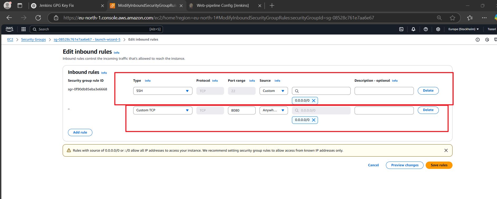

# Jenkinsproject

## Project Objective;

1. Jenkins server setup and configuration for CI/CD pipeline automation.
2. Source code management  repository integration with Jenkins 

3. Jenkins freestyle Job and unit test. 
4. Jenkins Pipeline for a running web application. 

5. Docker image Creation  and Registry Push 

## Project Requirements;

1. Compute: AWS EC2 Instance for hosting jenkins 
2. Creation of Security Groups to allow SSH and HTTP traffic 

## STEPS;

## Created an Instance on AWS for Jenkins server 

Allow SSH Traffic 

## Connect ing to the server via SSH

## Installing necessary dependencies 

`sudo apt update`

`sudo apt install jdk`

## Install Jenkins

`Sudo apt-get install Jenkins `

## Jenkins is running 

## Getting started, Unlock Jenkins 

## Cat Password for Jenkins 

## Customise Jenkins 

## Setting up Admin User 

## Instance Configuration

## Jenkins is Ready

## Pluggin 

## Source Code Management 

## Trigger 

##  Created a Freestyle Job

## Freestyle Trigger 

## Before editing the Read ME file to test Trigger 

## The Edited READ ME file 

## Trigger Succeeded 

##  Overview 

##  Docker Installation

## Index File

## Push Index File to Github

## Setting Up Global Credentials 

## Pipeline 

## Trigger 

## Pipeline Syntax

## Pipeline Script

## Docker Hub Push to Repository Successful

`Jenkins-webappproject`

## Edited Index File for Website 

## Allowed http acccess of Jenkins server instance
 

## Accessing website with Ip address and port

# Overview of Successful Jenkins Jobs 

